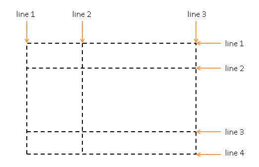

# ?Grid

Первый подробный проект макета grid для CSS был создан Филом Каппом из Microsoft в 2011 году.

### Создание grid-контейнера

Для создания grid-контейнера необходимо присвоить его стилевому свойству `display` одно из двух значений: `grid` или `inline-grid`.

Если значение `grid` определяет контейнер как блочный элемент, то значение `inline-grid` определяет элемент как строчный (`inline`).

### Строки и столбцы

Грид образует сетку из строк и столбцов, на пересечении которых образуются ячейки. И для установки строк и столбцов в Grid Layout использовать следующие свойства CSS3:

* `grid-template-columns`: настраивает столбцы.

~~~
.grid-container {
  display: grid;
  grid-template-columns: 8em 8em;
}
~~~

В качестве значения свойству `grid-template-columns` передается ширина столбцов. Сколько мы хотим иметь в гриде столбцов, столько и нужно передать значений этому свойству. Так, в случае выше грид содержит два столбца.

* `grid-template-rows`: настраивает строки.

~~~
.grid-container {
  display: grid;
  grid-template-rows: 4em 5em;
}
~~~

Свойству `grid-template-rows` передается высота каждой из строк. Так, в данном случае высота первой строки составляет `4em`, а второй -` 5em`.

В то же время, если элементов больше, чем ячеек грида, то образуются дополнительные строки (как в случае со столбцами). Поэтому, несмотря на то, что выше были определены настройки только для двух строк, в реальности строк в гриде будет три строки, причем, высота третьей строки будет вычисляться автоматически.

Изменим стили grid-контейнера, добавив еще две строки:

~~~
.grid-container {
  display: grid;
  grid-template-columns: 8em 8em 8em;
  grid-template-rows: 5em 5em 5em 5em;
}
~~~

Если ячеек грида больше, чем элементов, то строка оказывается пустой.

### Функция `repeat`

Если у нас столбцов и(или) строк много и они имеют одинаковые размеры, то есть смыл использовать специальную функцию `repeat()`, которая позволит настроить строки и столбцы.

~~~
grid-template-columns: 8em 8em 8em;
grid-template-rows: 5em 5em 5em 5em;

===

grid-template-columns: repeat(3, 8em);
grid-template-rows: repeat(4, 5em);
~~~

Можно задавать повторение нескольких столбцов и строк:

~~~
grid-template-columns: repeat(2, 7em 8em);
grid-template-rows: 6em repeat(3, 5em);
~~~

В данном случае будет создано 4 столбца: два раза будут повторяться два столбца с шириной `7em` и `8em`.

В случае со строками будет создано 4 строки. Причем первая будет иметь высоту в `6em`, а остальные три - `5em`.

### Свойство `grid`

Свойство `grid` объединяет свойства `grid-template-rows` и `grid-template-columns` и разом позволяет задать настройки для строк и столбцов в следующем формате:

~~~
grid: grid-template-rows / grid-template-columns;
~~~

~~~
grid-template-rows: 5em 5em 5em 5em;

===

grid: 5em 5em 5em 5em / 8em 8em 8em;

===

grid: repeat(4, 5em) / repeat(3, 8em);
~~~

### `grid-auto-rows`, `grid-auto-columns`, `grid-auto-flow`

Свойство `grid-auto-rows` задает размер для строк в контейнере Grid. Это свойство влияет только на строки с неустановленным размером. Значение по умолчанию: `auto`.

Свойство `grid-auto-columns` задает размер столбцов в контейнере Grid. Это свойство влияет только на столбцы с неустановленным размером. Значение по умолчанию: `auto`.

Свойство `grid-auto-flow` управляет тем, как автоматически размещаемые элементы вставляются в сетку.

Значения:

* `row`.	Значение по умолчанию. Вставка автоматически размещаемых элементов путем заполнения каждой строки	
* `column`.	Вставка автоматически размещаемых элементов путем заполнения каждого столбца	
* `row dense`. Вставка автоматически размещаемых элементов путем заполнения каждой строки и заполнения всех отверстий в сетке	
* `column dense`.	Вставка автоматически размещаемых элементов путем заполнения каждого столбца и заполнения всех отверстий в сетке

### Размеры строк и столбцов

Для определения размеров мы можем использовать самые различные единицы измерения, которые нам доступны в CSS (`px`, `em`, `rem`, `pt`, `%`).

Кроме точных размеров можно задавать автоматические размеры с помощью слова `auto`. В этом случае ширина столбцов и высота строк вычисляются исходя из размеров содержимого.

Для установки пропорциональных размеров применяется специальная единица измерения `fr`. Она представляет собой часть пространства (fraction), которое отводится для данного столбца или строки. Значение `fr` еще называют flex-фактором (flex factor).

Вычисление пропорциональных размеров производится по формуле:

~~~
flex-фактор * доступное_пространство  / сумма всех flex-факторов
~~~

Например, имеются три столбца с шириной 8em, 2fr, 1fr. Поэтому ширина второго столбца будет вычисляться по формуле:

~~~
2 * (ширина_грида - 8em) / (2 + 1)
~~~

Ширина третьего столбца будет вычисляться по формуле:

~~~
1 * (ширина_грида - 8em) / (2 + 1)
~~~

И если первый столбец фиксированный с шириной `8em`, то ширина второго и третьего столбца будут зависеть от ширины контейнера и будут автоматически масштабироваться при ее изменении.

В отношении строк все аналогично.

#### `minmax()`

При задании размеров явного грида или при определении размеров автоматически создаваемых колонок или строк нам может понадобиться задать трекам минимальный размер, но при этом быть уверенными, что они треки растянутся, чтобы вместить весь добавленный в них контент. Например, мне нужно, чтобы строки никогда не становились меньше `100` пикселей, но если контент занимает `300` пикселей в высоту, я бы хотел растянуть строку на эту высоту.

В гриде есть решение этой задачи – функция `minmax()`.

~~~
grid-auto-rows: minmax(100px, auto);
~~~

Автоматически создаваемые строки будут как минимум `100` пикселей в высоту, а как максимум – примут значение `auto`. Использование `auto` означает следующее: высота строки «растягивается» до размера ячейки с самым высоким элементом контента.

### Отступы между столбцами и строками

Для создания отступов между столбцами и строками применяются свойства `column-gap` и `row-gap` соответственно.

Вместо них можно определить одно свойство `gap`, которое установит оба отступа.

### Позиционирование элементов

Грид представляет собой набор ячеек, которые образуются на пересечении столбцов и строк. Но сами строки и столбцы образуются с помощью grid-линий, которые рассекают грид по вертикали и горизонтали:

И по умолчанию каждый элемент в гриде позиционируется в одну ячейку по порядку. Но мы можем более точно настроить расположение элемента в гриде с помощью ряда свойств:

* `grid-row-start`: задает начальную горизонтальную grid-линию, с которой начинается элемент
* `grid-row-end`: указывает, до какой горизонтальной grid-линии надо растягивать элемент
* `grid-column-start`: задает начальную вертикальную grid-линию, от которой начинается элемент
* `grid-column-end`: указывает, до какой вертикальной grid-линии нужно растягивать элемент

Например, растянем элемент на несколько столбцов:

~~~
.special-item{
  grid-column-start: 3;
  grid-column-end: 5;
}
~~~

Вместо использования двух выше рассмотренных свойств мы можем использовать одно свойство - `grid-column`, которое принимает значения `grid-column-start` и `grid-column-end` через слеш:

~~~
grid-column: grid-column-start / grid-column-end;
~~~

Например, мы можем сократить стиль класса `special-item` следующим образом:

~~~
.special-item{
  grid-column: 3 / 5;
}
~~~

Аналогично с помощью свойств `grid-row-start` и `grid-row-end` можно задать позиционирование элемента на несколько строк. Вместо использования пары свойств `grid-row-start` и `grid-row-end` можно использовать одно общее свойство `grid-row`.

С помощью специального слова `span` можно задать растяжение элемента на несколько ячеек. После слова span указывается, на какое количество ячеек надо растянуть элемент:

~~~
.special-item{
  grid-row: 1 / span 2;
  grid-column: 2 / span 2;
}
~~~

Свойство `grid-area` объединяет свойства `grid-column` и `grid-row`, позволяя сократить их запись:

~~~
grid-area: row-start / column-start / row-end / column-end

grid-area: 1 / 2 / 3 / 4;
~~~

### Наложение элементов

Манипулируя положением элементов мы легко можем осуществить их наложение, создать своего рода слои из элементов.

~~~
.item1{
  grid-area: 1 / 1 / 3 / 4;
}

.item2{
  grid-area: 1 / 1 / 2 / 2;
}
~~~

### Свойство `order`

Свойство `order` позволяет задать порядок элементов. По умолчанию для каждого элемента в гриде это свойство имеет значение `0`. Поэтому элементы располагаются друг за другом как они определены в разметке html. Но мы можем переопределить этот порядок.

Если же необходимо поставить одни элементы перед другими, то можно использовать отрицательное значение для свойства `order`. Элементы с `order` `1`, поэтому они будут располагаться после других элементов, у которых порядок равен `0` или меньше.

### Именованные grid-линии

В Grid Layout мы можем дать наименование каждой линии грида, присвоив ей какое-либо имя в квадратных скобках и затем, используя это имя, позиционировать элементы.

При именовании линий их имена заключаются в квадратные скобки, а между для именами указывается ширина столбца или высота строки, которые находятся между этими линиями:

~~~
grid-template-columns: [col1start] 1fr [col1end] 10px
                        [col2start] 1fr [col2end] 10px
                        [col3start] 1fr [col3end];
grid-template-rows: [row1start] 1fr [row1end] 10px [row2start] 1fr [row2end];
~~~

Затем, используя эти названия, мы можем позиционировать элементы между определенными линиями:

~~~
.special-item{
  grid-column: col1start / col2end;
  grid-row: row1start;
}
~~~

Так, в данном случае элемент с классом `special-item` начинает от вертикальной линии `col1start` и растягивается до вертикальной линии `col2end`. И также он начинается от горизонтальной линии `row1start`, и так как конечная горизонтальная линия не указана, то элемент занимает только одну строку.

С помощью ранее рассмотренной функции `repeat` мы можем растиражировать столбцы и строки, которые создаются между именованными grid-линиями:

~~~
grid-template-columns: 10px repeat(3, [column] 1fr [colgutter] 10px);
grid-template-rows: 10px repeat(2, [row] 1fr [rowgutter] 10px);
~~~

При определении стиля элементов, используя имя grid-линий и их порядковый номер, мы можем явным образом указать с помощью свойств `grid-column` и `grid-row`, где именно должен располагаться элемент:

~~~
.special-item{
  grid-column: column 2; /* второй столбец с именем column */
  grid-row: row 1; /* первая строка с именем row */
}
~~~

И также стоит отметить, что вне зависимости от того, именованные строки, столбцы и grid-линии или неименованные, мы по прежнему можем позиционировать элементы, используя номера grid-линий.

### Области грида

Для определения областей у grid-контейнера применяется свойство `grid-template-areas`. Например, определим три области:

~~~
.grid-container {
  height: 100vh;
  display: grid;
  grid-template-areas: "header header"
                        "sidebar content"
                        "sidebar content";
  grid-template-columns: 150px 1fr;
  grid-template-rows: 100px 1fr 100px;
}
.header { grid-area: header; background-color: #bbb; }
.sidebar { grid-area: sidebar; background-color: #ccc; }
.content { grid-area: content; background-color: #eee; }
~~~

Выражение `"header header"` представляет первую строку и указывает, что область `header` занимает две ячейки подряд.

Следующее выражение `"sidebar content"` указывает на вторую строку, где область `sidebar` занимает первую ячейку, а `content` - вторую ячейку. Третья строка повторяет вторую.

Мы можем создавать промежутки (или жесткие «остановки») между ячейками. Это возможно с помощью записи через точку (`.`):

~~~
grid-template-areas:
  "header header header"
  "sidebar main main"
  ". footer footer"; /* first cell is empty */
~~~

Количество точек не имеет значения. Вместо этого мы могли бы сделать это:

~~~
"....... footer footer"; /* first cell is empty */
~~~

Для установки области у элементов задается свойство `grid-area`.

### `justify-self`, `align-self`, `place-self`

`justify-self`. Выравнивает элемент grid внутри ячейки по оси строки. Это значение применяется к элементу grid внутри одной ячейки.

`align-self`. Выравнивает элемент grid внутри ячейки по  оси столбца. Это значение применяется к содержимому внутри одного элемента grid.

`place-self` устанавливает свойства `align-self` и `justify-self` в одном объявлении.

### `justify-items`, `align-items`, `place-items`

`justify-items`. Выравнивает элементы grid вдоль оси строки. Это значение применяется ко всем элементам grid внутри контейнера.

`align-items`. Выравнивает элементы grid вдоль оси столбца. Это значение применяется ко всем элементам grid внутри контейнера.

`place-items`. устанавливает свойства `align-items` и  `justify-items` в одном объявлении.

> https://cssgridgarden.com/ - a game for learning CSS grid.

> https://css-tricks.com/snippets/css/complete-guide-grid/ - полное руководство по CSS Grid.
